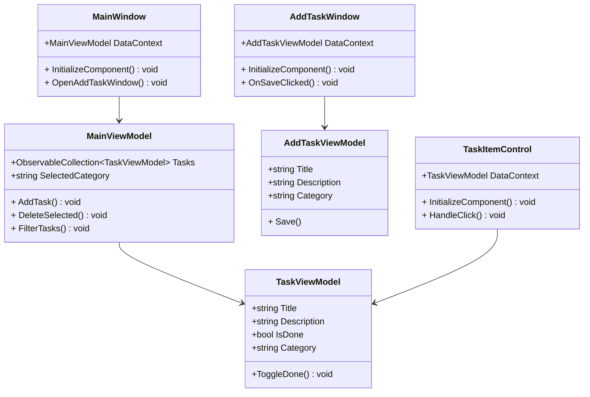
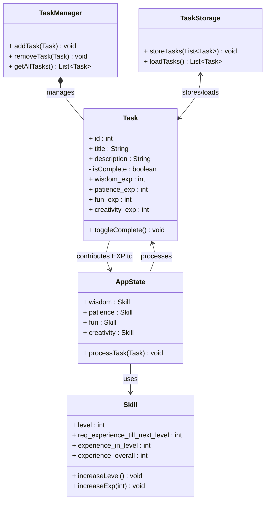

## UI-Klassendiagramme

```mermaid
classDiagram

%% Models


%% ViewModels
class MainViewModel {
  +ObservableCollection~TaskViewModel~ Tasks
  +string SelectedCategory
  + AddTask() void
  + DeleteSelected() void
  + FilterTasks() void
}

class TaskViewModel {
  +string Title
  +string Description
  +bool IsDone
  +string Category
  +ToggleDone() void
}

class AddTaskViewModel {
  +string Title
  +string Description
  +string Category
  + Save()
}

%% Views
class MainWindow {
  +MainViewModel DataContext
  + InitializeComponent() void
  + OpenAddTaskWindow() void
}

class TaskItemControl {
  +TaskViewModel DataContext
  + InitializeComponent() void
  + HandleClick() void
}

class AddTaskWindow {
  +AddTaskViewModel DataContext
  + InitializeComponent() void
  + OnSaveClicked() void
}

%% Beziehungen
MainWindow --> MainViewModel
MainViewModel --> TaskViewModel
TaskItemControl --> TaskViewModel
AddTaskWindow --> AddTaskViewModel
```

## Code-Klassendiagramme

```mermaid
classDiagram
    class Task {
        + id : int
        + title : String
        + description : String
        - isComplete : boolean

        + wisdom_exp : int
        + patience_exp : int
        + fun_exp : int
        + creativity_exp : int

        + toggleComplete() void
    }

    class TaskManager {
        + addTask(Task) void
        + removeTask(Task) void
        + getAllTasks() List~Task~
    }

    class TaskStorage {
        + storeTasks(List~Task~) void
        + loadTasks() List~Task~
    }

    class AppState {
        + wisdom : Skill
        + patience : Skill
        + fun : Skill
        + creativity : Skill

        + processTask(Task) void
    }

    class Skill {
        + level : int
        + req_experience_till_next_level : int
        + experience_in_level : int
        + experience_overall : int

        + increaseLevel() void
        + increaseExp(int) void
    }

    TaskManager *-- Task : manages
    TaskStorage <--> Task : stores/loads
    AppState--> Skill : uses
    AppState--> Task : processes
    Task --> AppState: contributes EXP to

```
