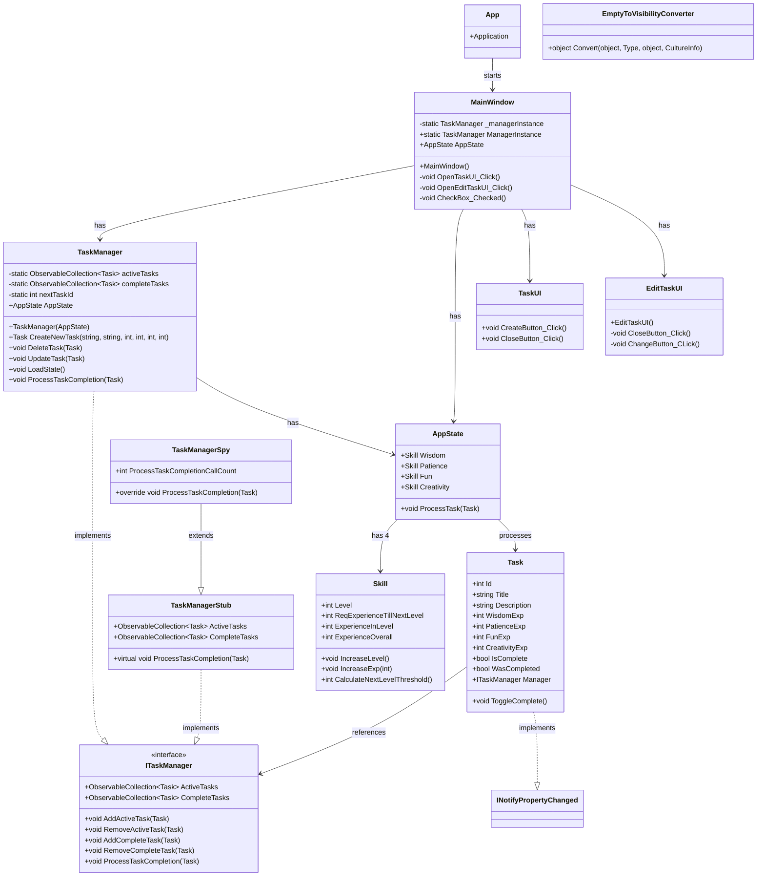

```mermaid
classDiagram
    class App {
        +Application
    }
    
    class MainWindow {
        -static TaskManager _managerInstance
        +static TaskManager ManagerInstance
        +AppState AppState
        +MainWindow()
        -void OpenTaskUI_Click()
        -void OpenEditTaskUI_Click()
        -void CheckBox_Checked()
    }
    
    class ITaskManager {
        <<interface>>
        +ObservableCollection~Task~ ActiveTasks
        +ObservableCollection~Task~ CompleteTasks
        +void AddActiveTask(Task)
        +void RemoveActiveTask(Task)
        +void AddCompleteTask(Task)
        +void RemoveCompleteTask(Task)
        +void ProcessTaskCompletion(Task)
    }
    
    class TaskManager {
        -static ObservableCollection~Task~ activeTasks
        -static ObservableCollection~Task~ completeTasks
        -static int nextTaskId
        +AppState AppState
        +TaskManager(AppState)
        +Task CreateNewTask(string, string, int, int, int, int)
        +void DeleteTask(Task)
        +void UpdateTask(Task)
        +void LoadState()
        +void ProcessTaskCompletion(Task)
    }
    
    class Task {
        +int Id
        +string Title
        +string Description
        +int WisdomExp
        +int PatienceExp
        +int FunExp
        +int CreativityExp
        +bool IsComplete
        +bool WasCompleted
        +ITaskManager Manager
        +void ToggleComplete()
    }
    
    class AppState {
        +Skill Wisdom
        +Skill Patience
        +Skill Fun
        +Skill Creativity
        +void ProcessTask(Task)
    }
    
    class Skill {
        +int Level
        +int ReqExperienceTillNextLevel
        +int ExperienceInLevel
        +int ExperienceOverall
        +void IncreaseLevel()
        +void IncreaseExp(int)
        +int CalculateNextLevelThreshold()
    }
    
    class TaskUI {
        +void CreateButton_Click()
        +void CloseButton_Click()
    }
    
    class EditTaskUI {
        +EditTaskUI()
        -void CloseButton_Click()
        -void ChangeButton_CLick()
    }
    
    class EmptyToVisibilityConverter {
        +object Convert(object, Type, object, CultureInfo)
    }
    
    class TaskManagerStub {
        +ObservableCollection~Task~ ActiveTasks
        +ObservableCollection~Task~ CompleteTasks
        +virtual void ProcessTaskCompletion(Task)
    }
    
    class TaskManagerSpy {
        +int ProcessTaskCompletionCallCount
        +override void ProcessTaskCompletion(Task)
    }

    App --> MainWindow : starts
    MainWindow --> TaskManager : has
    MainWindow --> AppState : has
    MainWindow --> TaskUI : has
    MainWindow --> EditTaskUI : has
    TaskManager ..|> ITaskManager : implements
    TaskManagerStub ..|> ITaskManager : implements
    TaskManagerSpy --|> TaskManagerStub : extends
    TaskManager --> AppState : has
    Task --> ITaskManager : references
    AppState --> Skill : has 4
    AppState --> Task : processes
    Task ..|> INotifyPropertyChanged : implements
```
